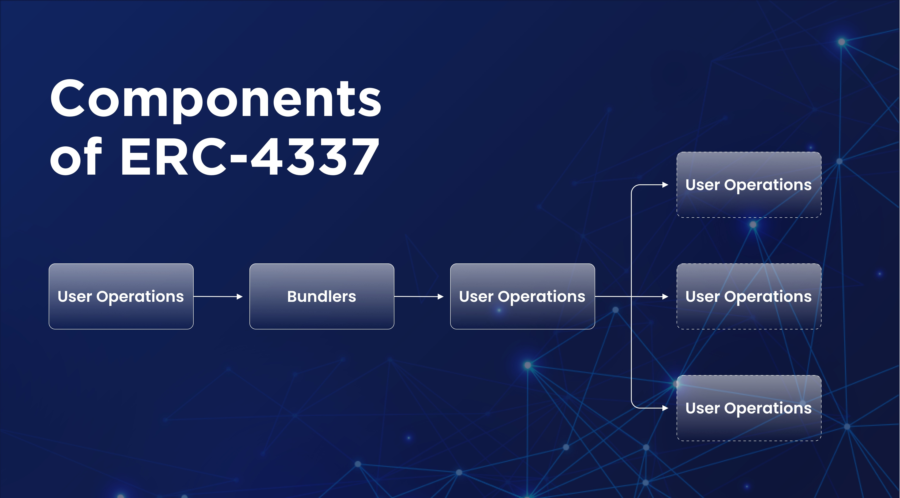

# Introduction

the simplified overview of ERC-4337 so that developers can get a basic understanding of the different components and how they can be pieced together to build their applications. more details for [ERC-4337](https://eips.ethereum.org/EIPS/eip-4337)

There are four main components to ERC-4337: a User Operation, Bundler, EntryPoint, and Smart Account (aka Contract Account). These can be supplemented by Paymasters and Aggregators.

+ UserOperations are pseudo-transaction objects that are used to execute transactions with contract accounts. These are created by your app.
+ Bundlers are actors that package UserOperations from a mempool and send them to the EntryPoint contract on the blockchain.
+ EntryPoint is a singleton smart contract that handles the verification and execution logic for transactions.
+ Contract Accounts are smart contract accounts owned by a user.
+ Paymasters are optional smart contract accounts that can sponsor transactions for Contract Accounts.
+ Aggregators are optional smart contracts that can validate signatures for multiple Contract Accounts.

## User Operations

All components of ERC-4337 revolve around a pseudo-transaction object called a UserOperation which is used to execute actions through a smart contract account. It captures the intent of what the user wants to do. This isn't to be mistaken for a regular transaction type.

|Field | Type | Description |
|--------|---------|------------|
|sender |	address	|The address of the smart account sending the User Operation.|
|nonce |	uint256	|Anti-replay protection.|
|initCode|	bytes	|Code used to deploy the sender if not yet on-chain.|
|callData	|bytes|	Data that's passed to the sender for execution.|
|callGasLimit	|uint256	|Gas limit for the execution phase.|
|verificationGasLimit	|uint256|	Gas limit for the verification phase.|
|preVerificationGas	|uint256|	Gas to compensate the bundler for the overhead to submit the User Operation.|
|maxFeePerGas	|uint256	|Similar to EIP-1559 maxFeePerGas|
|maxPriorityFeePerGas|	uint256	|Similar to EIP-1559 maxPriorityFeePerGas.|
|paymasterAndData|	bytes	|Paymaster contract address and any extra data the paymaster contract needs for verification and execution. When set to 0x or the zero address, no paymaster is used.|
|signature	|bytes	|Used to validate a User Operation during verification.|

## Bundler

A Bundler is a class of actors that sends User Operations to the EntryPoint. Specifically, it:

+ Listens to at least one UserOperation mempool.
+ Runs simulations.
+ Bundles an array of User Operations.
+ Relays bundles to the EntryPoint.

the bundler [rpc](./bundler.md)

## EntryPoint

The EntryPoint is a singleton contract that acts as a central entity for all ERC-4337 Smart Accounts and Paymasters. It coordinates the verification and execution of a User Operation. For this reason, it's important for all implementations of an EntryPoint to be audited and immutable.

## Smart Account

The Smart Account is an end user's account. At minimum it needs to check whether or not it will accept a User Operation during the verification loop.

Additional features to support other account functions like social recovery and multi-operations can be added here too.

## Paymaster

The Paymaster is an entity that is able to sponsor the gas fees of a UserOperation. It is required to do two things:

Check whether or not it will accept a User Operation during the verification loop.
Run any required fee logic in the execution loop.
An example of Paymaster logic could be to withdraw a certain amount of ERC-20 tokens from the Smart Account after the UserOperation is executed. This allows users to pay for gas in any currency they choose.

## Aggregator

The Aggregator is an entity that is trusted by Contract Accounts to validate signatures. They are often used to aggregate signatures from multiple UserOperations together.

## Example