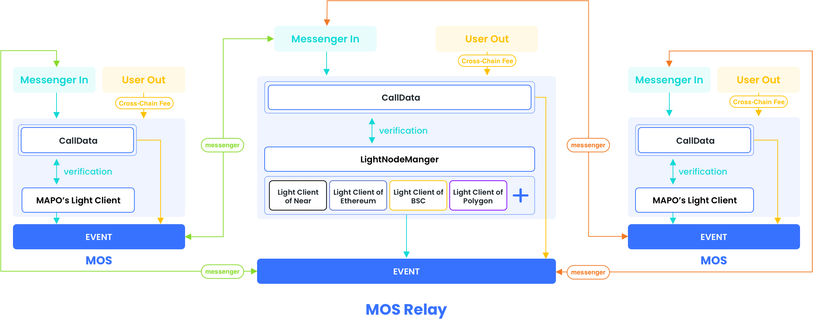

# Cross-chain message

MAPO's cross-chain messaging (MOS) enables projects built on one chain to easily synchronize some project information to other chains, and can also call contract methods on other connected chains。（MOS uses a light client to verify the transaction of cross-chain messages to ensure that cross-chain messages are authentic and checkable on the chain)

With MOS you can:

- Call a contract on chain B from chain A.
- Pack the message changes in chain A and write them into chain B to realize message synchronization

### Prerequisites

- For MOS to work, both chain A and chain B must be EVM chains with the MAPO light client deployed。(MOS for Near Chain is still under development)
- The executable contract authority of the cross-chain message must be authorized to the MOS contract on the corresponding chain。
- The application must be on one of the EVM chains supported by MAPO。See [chain names](https://docs.mapprotocol.io/develop/light-client) for a list of chains where MAPO light clients are deployed. The list is updated as new chains are added.

### How MOS completes cross-chain message

#### At the source chain

1. The user (dApp) sorts out the messages that need to be cross-chained, and organizes the callData called by the target chain,
2. The user calls the transferOut method of MOS, and the gas fee for the cross-chain is attached。
3. MOS sends a cross-chain transaction and pops up a cross-chain message log. You can view the details of the transaction on the browser of the source chain.

#### At the MAPO network

1. The MAPO network confirms the transaction log of the source chain, verifies the authenticity of the source chain transaction through the light client, judges that it is going to another chain, sends the transaction, and continues to pop up the cross-chain message log. If MAPO is the target chain, execute the call method and pop up the execution log.。

#### At the destination chain

1. Messenger detects MAPO's message cross-chain log, and verifies the authenticity of MAPO's transaction through the light client.
2. Messenger builds profData to call the transfer method of MOS, pops up the execution transaction log, and completes the message cross-chain contract call.

### Flow architecture

